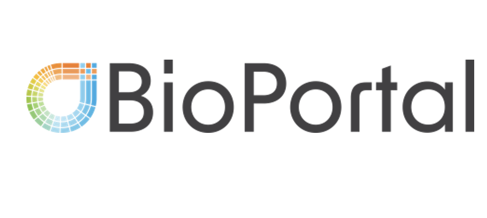

**What we do**: Our lab uses human genetics and multi-omics to understand the biology of diabetes, obesity, and cardiovascular diseases and to identify potential drug targets for them, aiming to improve patient care.

**Our research focus**: Our lab focuses on three main pillars:
1. Large-scale human genetics and multi-omics analysis for drug target discovery: We use genomics, proteomics, and other omics in combination with genetic epidemiology methods to understand the underlying mechanisms of diabetes, obesity, and cardiovascular diseases, and to identify potential drug targets.

2. Building and analyzing [BioPortal](https://www.mcgill.ca/bioportal/): We are creating and analyzing a new multi-ancestry, multi-omics biobank of 12,500 individuals in Montreal to accelerate drug development and advance precision medicine.

3. Disentangling the heterogeneity of diabetes and complex diseases: We dissect the genetic heterogeneity of diabetes and complex traits to understand their distinctive biology, identify drug targets, and ultimately promote precision medicine.
 

**Who we are**: We are a group of ambitious and forward-looking researchers who enjoy science. We are members of [McGill University Department of Human Genetics](https://www.mcgill.ca/humangenetics/), [McGill Genomic Medicine CERC Program](https://www.genomic-medicine-cerc.online/), and [McGill Genome Centre](https://www.mcgillgenomecentre.ca/).  
The PI is also affiliated with [McGill’s Quantitative Life Sciences Program](https://www.mcgill.ca/qls/satoshi-yoshiji/). He holds a visiting scholar position at [the Broad Institute of MIT and Harvard](https://www.broadinstitute.org/), and [the Mass General Brigham Research Institute](https://cgm.massgeneral.org/).

**News**: 
Jan, 2025.  
• Our paper has been published in Nature Genetics!  
We integrated large-scale genomics, proteomics, and other omics to ask a question of "Does plasma proteins mediate obesity’s effect on coronary artery disease risk?"  
Using two-step proteome-wide MR, domain-aware MR, epigenomics & scRNA-seq, we prioritized endotrophin as a mediator & potential therapeutic target.  

Satoshi Yoshiji, Tianyuan Lu, Guillaume Butler-Laporte, Julia Carrasco-Zanini-Sanchez, Chen-Yang Su, Yiheng Chen, Kevin Liang, Julian Daniel Sunday Willett, Shidong Wang, Darin Adra, Yann Ilboudo, Takayoshi Sasako, Satoshi Koyama, Tetsushi Nakao, Vincenzo Forgetta, Yossi Farjoun, Hugo Zeberg, Sirui Zhou, Michael Marks-Hultström, Mitchell J. Machiela, Rama Kaalia, Hesam Dashti, Melina Claussnitzer, Jason Flannick, and J. Brent Richards. Integrative proteogenomic analysis identifies COL6A3-derived endotrophin as a mediator of the effect of obesity on coronary artery disease. *Nat Genet* (2025).  
[https://doi.org/10.1038/s41588-024-02052-7](https://doi.org/10.1038/s41588-024-02052-7)  

• Yefeng Yang, a PhD student from [the McGill QLS program](https://www.mcgill.ca/qls/) has joined the lab as a rotation student. Welcome, Yefeng!

Dec, 2024.  
Satoshi gave an invited talk at Korean Society of Medical Genetics and Genomics (KSMGG) and East Asian Union of Human Genetics Society (EAUHGS) on "Using Proteomics and Genomics to Understand Complex Diseases and Identify Drug Targets"

Nov, 2024.  
• Our multi-ancestry proteome-phenome-wide MR atlas work is out!  
Multi-ancestry proteome-phenome-wide Mendelian randomization offers a comprehensive protein-disease atlas and potential therapeutic targets  

Chen-Yang Su, Adriaan van der Graaf, Wenmin Zhang, Dong-Keun Jang, Susannah Selber-Hnatiw, Ta-Yu Yang, Guillaume Butler-Laporte, Kevin Y. H. Liang, Yiheng Chen, Fumihiko Matsuda, Maria C. Costanzo, J. Brent Richards, Noel P. Burtt, Jason Flannick, Sirui Zhou, Vincent Mooser, Tianyuan Lu, Satoshi Yoshiji.  *medRxiv* 2024.10.17.24315553; doi: [https://doi.org/10.1101/2024.10.17.24315553](https://doi.org/10.1101/2024.10.17.24315553).  
Interactive browser: [https://broad.io/protein_mr_atlas](https://broad.io/protein_mr_atlas)   
This was made possible through the collaboration with the Knolwedge Protal Team at the Broad Institute  
  
• Satoshi gave an invited talk with Dr. Jason Flannick and his colleagues at the Medical and Population Genetics Seminar at the Broad Institute of MIT and Harvard.

• Chen-Yang Su, a PhD student at the lab, gave oral presentations at ASHG 2024 and IGES 2024 on our multi-ancestry proteome-phenome-wide MR atlas work. He was selected as a semifinalist for Neel Award.

• Satoshi's ASHG Abstract on disentangling the heterogeneity of type 2 diabetes, entitled "Novel multi-trait inference of full genome-wide associations of type 2 diabetes clusters uncovers distinctive biology and putatively causal genes",  was selected for a Reviewer's Choice.

Oct, 2024.  
• Chen-Yang Su, a PhD student at the lab, gave an oral presentation at CMDO-MILA Symposium "Research in Health and AI" and received the Best Presentation Award!

Sep, 2024.  
 Satoshi gave a lecture at McGill QLS/CAMBAM Seminar on "Leveraging genomics, proteomics, and other omics for drug target discovery in cardiometabolic diseases and complex traits: Toward better clinical care".
Recording is available at [YouTube](https://youtu.be/N5BREyi7r2U?si=eCXClwXmhx9x7Dw9&t=102)  
