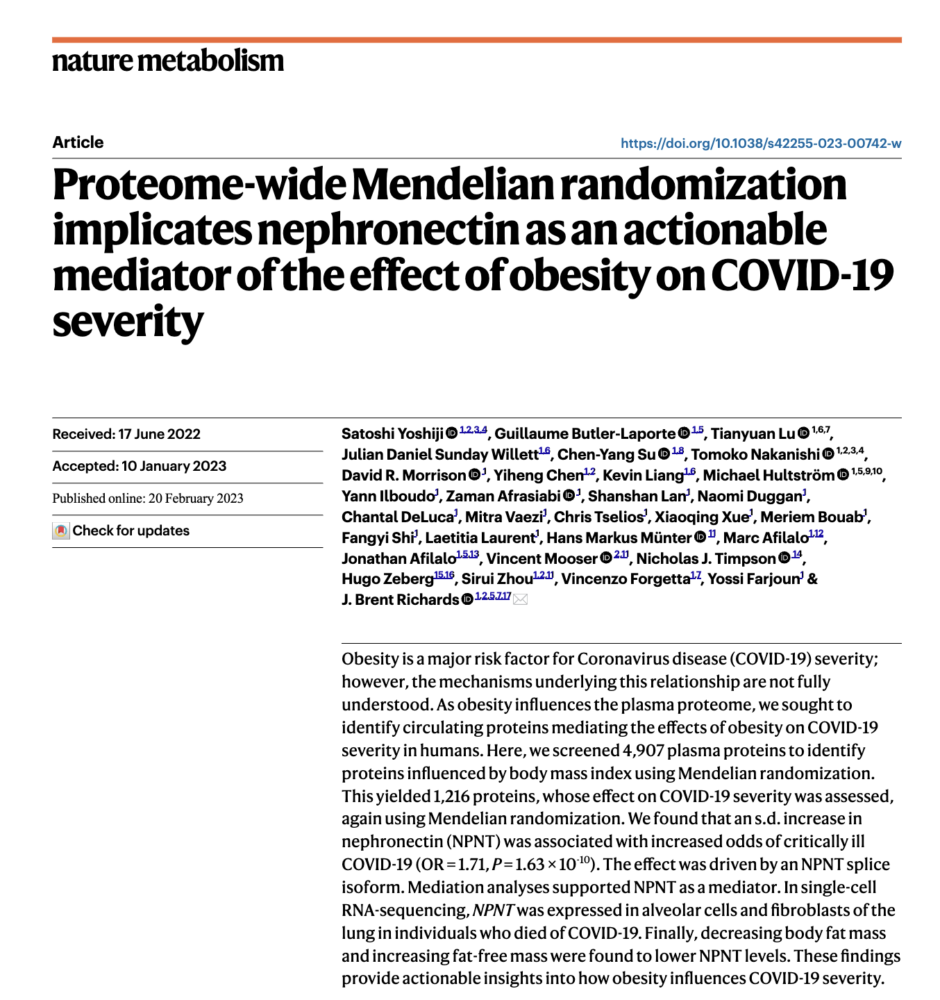

Selected publications

Satoshi Yoshiji, Tianyuan Lu, Guillaume Butler-Laporte, Julia Carrasco-Zanini-Sanchez, Chen-Yang Su, Yiheng Chen, Kevin Liang, Julian Daniel Sunday Willett, Shidong Wang, Darin Adra, Yann Ilboudo, Takayoshi Sasako, Satoshi Koyama, Tetsushi Nakao, Vincenzo Forgetta, Yossi Farjoun, Hugo Zeberg, Sirui Zhou, Michael Marks-Hultström, Mitchell J. Machiela, Rama Kaalia, Hesam Dashti, Melina Claussnitzer, Jason Flannick, and J. Brent Richards. Integrative proteogenomic analysis identifies COL6A3-derived endotrophin as a mediator of the effect of obesity on coronary artery disease. *Nat Genet* (2025).  
[https://doi.org/10.1038/s41588-024-02052-7](https://doi.org/10.1038/s41588-024-02052-7)  

Chen-Yang Su, Adriaan van der Graaf, Wenmin Zhang, Dong-Keun Jang, Susannah Selber-Hnatiw, Ta-Yu Yang, Guillaume Butler-Laporte, Kevin Y. H. Liang, Yiheng Chen, Fumihiko Matsuda, Maria C. Costanzo, J. Brent Richards, Noel P. Burtt, Jason Flannick, Sirui Zhou, Vincent Mooser, Tianyuan Lu, Satoshi Yoshiji.  *medRxiv* 2024.10.17.24315553; doi: [https://doi.org/10.1101/2024.10.17.24315553](https://doi.org/10.1101/2024.10.17.24315553).  
Interactive browser: [https://broad.io/protein_mr_atlas](https://broad.io/protein_mr_atlas)   

Satoshi Yoshiji, Guillaume Butler-Laporte, Tianyuan Lu, Julian Daniel Sunday Willett, Chen-Yang Su, Tomoko Nakanishi, David R. Morrison, Yiheng Chen, Kevin Liang, Michael Hultström, Yann Ilboudo, Zaman Afrasiabi, Shanshan Lan, Naomi Duggan, Chantal DeLuca, Mitra Vaezi, Chris Tselios, Xiaoqing Xue, Meriem Bouab, Fangyi Shi, Laetitia Laurent, Hans Markus Münter, Marc Afilalo, Jonathan Afilalo, Vincent Mooser, Nicholas J. Timpson, Hugo Zeberg, Sirui Zhou, Vincenzo Forgetta, Yossi Farjoun, and J. Brent Richards.  
*Nat Metab* 5, 248–264 (2023). [https://doi.org/10.1038/s42255-023-00742-w](https://doi.org/10.1038/s42255-023-00742-w)


  
You can also find our articles on <a href="{{site.author.googlescholar}}">my Google Scholar profile</a>.


