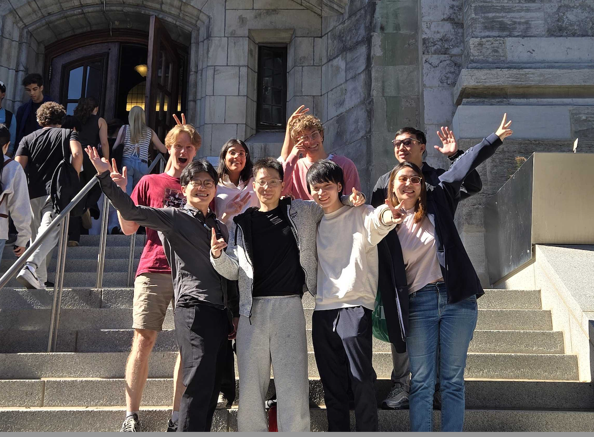
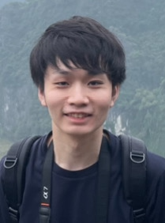
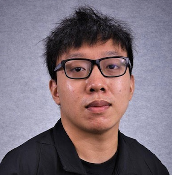
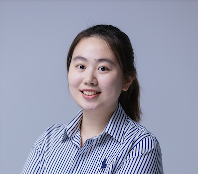
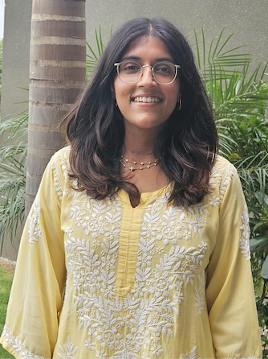
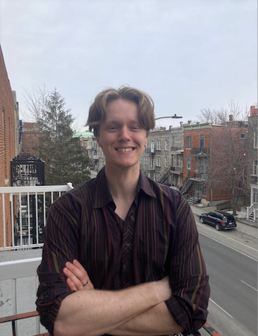
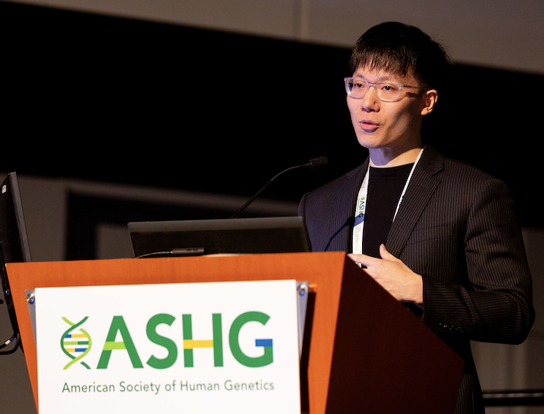
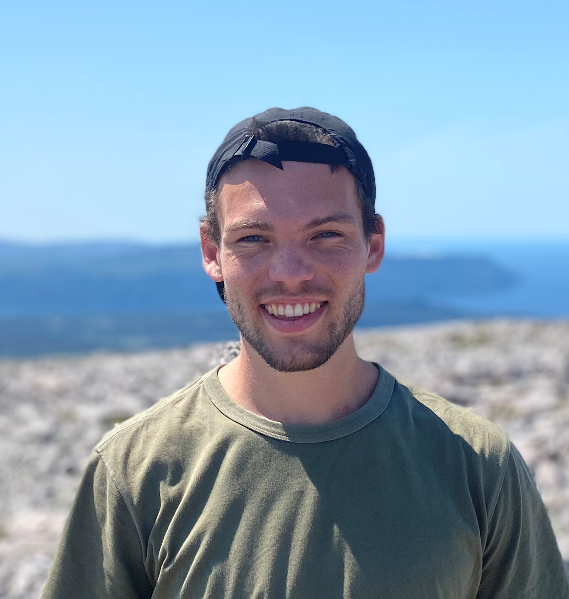

  

**Satoshi Yoshiji, MD, PhD** 
Principal Investigator 
Satoshi Yoshiji is a Tenure-Track Assistant Professor at McGill University Department of Human Genetics, McGill Genomic Medicine CERC Program, and McGill Genome Centre. He is also affiliated with McGill’s Quantitative Life Sciences Program. 
He holds a visiting scholar position at the Broad Institute of MIT and Harvard, and the Mass General Brigham Research Institute. 
Satoshi is an endocrinologist by training and is board-certified in Endocrinology and Internal Medicine. His guiding principle is to ask clinically relevant questions and solve them using human genetics. His research focuses on obesity, diabetes, and cardiovascular diseases, and he aims to ultimately improve clinical care by identifying potential drug targets and promoting genetics and omics-guided precision medicine. 
Following his residency and fellowship at Kyoto University and its affiliated hospitals, he earned a joint PhD in Human Genetics from McGill University and Kyoto University. During his PhD, he leveraged large-scale genomics and proteomics to identify therapeutic targets. 
He then joined the Broad Institute of MIT and Harvard in Boston as a Research Fellow, where he developed computational frameworks to disentangle the heterogeneity of complex diseases, particularly type 2 diabetes. 
In the summer of 2024, he returned to Montreal to establish his lab. His lab focuses on research in (1) large-scale human genetics and multi-omics data analysis for cardiometabolic diseases, (2) building a diverse multi-omics biobank in Montreal, and (3) disentangling the heterogeneity of diabetes and complex diseases. 

**Masashi Hasebe, MD** 
PhD student 
Masashi Hasebe is a Ph.D. student in the Kyoto-McGill International Collaborative Program in Genomic Medicine, co-supervised by Satoshi Yoshiji at McGill University and Daisuke Yabe at Kyoto University. He earned his M.D. from Kyoto University in 2018 and completed his endocrinology training at affiliated hospitals. 
His interests focus on using omics technologies to understand complex metabolic and cardiovascular diseases better, aiming to improve personalized patient care. 

**Yefeng Yang, MSc** 
PhD student 
Yefeng Yang is a first-year PhD student in the Quantitative Life Sciences program, supervised by Prof. Satoshi Yoshiji. 
He holds a Master’s degree in Biostatistics from Emory University and a Bachelor’s degree in Biotechnology and Food Engineering from the Technion - Israel Institute of Technology. 
His research focuses on multi-omics data analysis to explore connections between proteomics and phenotypic traits. Outside of academics, Yefeng enjoys playing basketball, badminton, and working out at the gym. 

**Megan Tsao, MSc** 
Hsuan (Megan) Tsao is a PhD student under the supervision of Dr. Satoshi Yoshiji in Human Genetics at McGill University.  
She obtained her M.Sc. in Human Genetics at McGill University and her B.Sc. in Human Biology & Sociology at the University of Toronto. With interdisciplinary training and experience in basic science, clinical research, and the pharmaceutical industry, she is passionate about using multi-omics approach to dissect genotype–phenotype relationships in complex diseases across diverse ancestries, aiming to drive translational impact and advancing health equity.  

**Urvashi Singh** 
Urvashi Singh is a PhD student in Human Genetics at McGill, supervised by Dr. Satoshi Yoshiji and Dr. Sirui Zhou. She completed her BSc in Microbiology and Immunology from McGill.  
Prior to her PhD, she spent nearly three years working as a bioinformatician and statistical genetics scientist at 5 Prime Sciences, where she led and supported research programs that utilize human genetics evidence to accelerate drug development.  
Her research bridges genetics, causal inference, and multi-omics to understand the genetic architecture of complex traits to improve drug target identification and validation. She is a passionate advocate for healthcare accessibility and equity, and wants to extend these principles to her work in statistical genetics research. Outside of science, she is a percussionist, loves painting, hiking, and working out.  

**Leighton Smith, BSc** 
Leighton Smith is an MSc student in the Department of Human Genetics at McGill University supervised by Dr. Yoshiji.  
He graduated from McGill in 2024 with a BSc in Honours in Immunology. His research will involve the analysis of genomic data to identify potential drug targets in complex diseases.  
In his spare time he enjoys playing sports and programming video games.  

Alumni 
**Chen-Yang Su, MSc** 
PhD student 

**Maya Akerman** 
Undergraduate intern 

**Eloi Gagnon** 
PhD intern in 2024 

