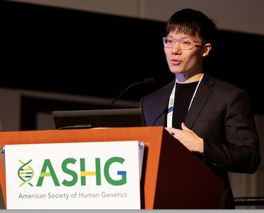
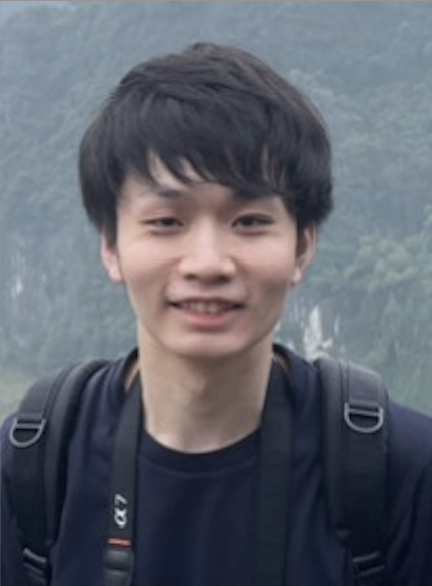

**Satoshi Yoshiji, MD, PhD** 
Principal investigator 
Satoshi Yoshiji is a Tenure-Track Assistant Professor at McGill University Department of Human Genetics, McGill Genomic Medicine CERC Program, and McGill Genome Centre. He is also affiliated with McGill’s Quantitative Life Sciences Program. 
He holds a visiting scholar position at the Broad Institute of MIT and Harvard, and the Mass General Brigham Research Institute. 
Satoshi is an endocrinologist by training and is board-certified in Endocrinology and Internal Medicine. His guiding principle is to ask clinically relevant questions and solve them using human genetics. His research focuses on obesity, diabetes, and cardiovascular diseases, and he aims to ultimately improve clinical care by identifying potential drug targets and promoting genetics and omics-guided precision medicine. 
Following his residency and fellowship at Kyoto University and its affiliated hospitals, he earned a joint PhD in Human Genetics from McGill University and Kyoto University. During his PhD, he leveraged large-scale genomics and proteomics to identify therapeutic targets. 
He then joined the Broad Institute of MIT and Harvard in Boston as a Research Fellow, where he developed computational frameworks to disentangle the heterogeneity of complex diseases, particularly type 2 diabetes. 
In the summer of 2024, he returned to Montreal to establish his lab. His lab focuses on research in (1) large-scale human genetics and multi-omics data analysis for cardiometabolic diseases, (2) building a diverse multi-omics biobank in Montreal, and (3) disentangling the heterogeneity of diabetes and complex diseases. 

**Chen-Yang Su, MSc** 
PhD student 
Chen-Yang Su is a PhD student in Quantitative Life Sciences at McGill University and part of the Canada Excellence Research Chair in Genomic Medicine under the supervision of Prof. Satoshi Yoshiji and Prof. Sirui Zhou. 
Previously, he completed his M.Sc. (Computer Science, 2022) and B.Sc. (joint majoring in Biology and Computer Science, 2020) both at McGill University while being affiliated with the Lady Davis Institute at the Jewish General Hospital and Mila – Quebec AI Institute.
During his MSc, he had the opportunity to work with proteomics and genomics in the context of COVID-19 under the supervision of Dr. Brent Richards (Faculty of Medicine; CEO of 5 Prime Sciences) and Joelle Pineau (Faculty of Computer Science; Vice President, AI research at Meta). 
He has worked in industry briefly as a data scientist and his current broader interests are in using multi-omics approaches (proteomics, genomics, metabolomics) for precision medicine and drug target discovery. During his spare time, he likes to workout, try new food, and read. 

**Masashi Hasebe, MD** 
PhD student 
Masashi Hasebe is a Ph.D. student in the Kyoto-McGill International Collaborative Program in Genomic Medicine, co-supervised by Satoshi Yoshiji at McGill University and Daisuke Yabe at Kyoto University. He earned his M.D. from Kyoto University in 2018 and completed his endocrinology training at affiliated hospitals. 
His interests focus on using omics technologies to understand complex metabolic and cardiovascular diseases better, aiming to improve personalized patient care. 

**Éloi Gagnon, MSc** 
PhD intern/Incoming post-doctoral fellow 
As part of his PhD in statistical genetics at Laval University, Eloi is currently completing a placement in Professor Satoshi’s Lab. Passionate about using human genetics to advance drug development, his doctoral work has led to over a dozen first-author publications. These research projects focused on anticipating clinical trial outcomes, identifying potential side effects, understanding drug mechanisms of action, predicting interactions with other medications, and identifying patient populations likely to respond well to specific treatments.
Eloi has previously interned as a statistical geneticist at Apollo Therapeutics, a biotech company in Cambridge, UK, and served as an invited research fellow at Imperial College London. Additionally, he was President of the Student Committee at the Quebec Heart and Lung Institute Research Center. His work at the Canada Excellence Research Chair in Genomic Medicine focuses on leveraging large-scale genetic data to improve type 2 diabetes patient care. 

**Yefeng Yang, MSc** 
PhD student 
Yefeng Yang is a first-year PhD student in the Quantitative Life Sciences program, supervised by Prof. Satoshi Yoshiji. 
He holds a Master’s degree in Biostatistics from Emory University and a Bachelor’s degree in Biotechnology and Food Engineering from the Technion - Israel Institute of Technology. 
His research focuses on multi-omics data analysis to explore connections between proteomics and phenotypic traits. Outside of academics, Yefeng enjoys playing basketball, badminton, and working out at the gym. 

